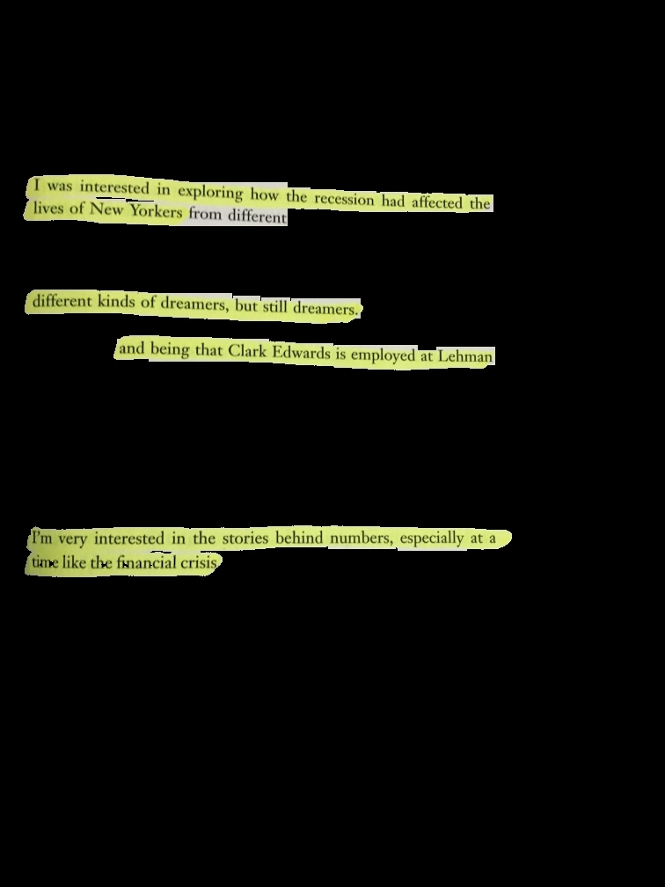

# Markups

Markups is a library written for Python and OpenCV that returns bounding boxes around areas of text that have been annotated by a reader. The library supports the following forms of annotations:
- Highlights

The following forms of annotations are still _in development_. To learn more about them, see CONTRIBUTING.md.
- Underlines
- Sidenotes

## Install from source
    git clone https://github.com/iRove108/markups.git
    cd markups
    pip install .

## Running the highlight extraction example
    cd examples/highlighted_text
    python main.py

The output should look something like this:

## Contributions
See CONTRIBUTING.md.
