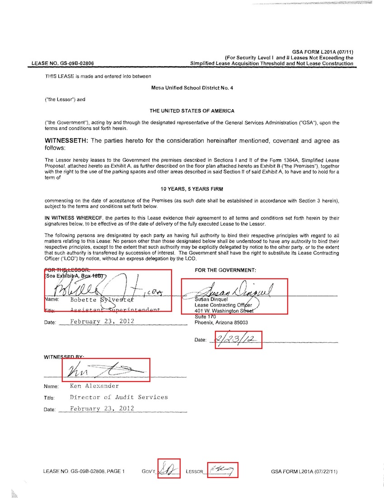

### Note: This code has been directly taken and adapted from [crazycloud's repo](https://github.com/crazycloud/Handwritten-text-Detection-Detectron2). The code is currently unlicensed, so I have opened an [issue](https://github.com/crazycloud/Handwritten-text-Detection-Detectron2/issues/1) about adding a license. I expect this will be resolved, but if the author prohibits this usage, I will take this down immediately.

## Handwritten Text Detection in Document Imgages 
We wish to detect the handwritten text in the scanned/pdf document. It could be for number of reasons like

  * to identify if the document has been signed
  * to process handwritten text in the document in a different way
  * to mask the handwritten text
  
Take following document image for an example. We wish to detect the text highlighted in the red bounding boxes.


## Downloading the Full Dataset
Once you've navigated to the sidenotes directory in terminal, run:
```
pip install azure-storage-blob
python download_dataset.py
mv datasets/train_data/JPEGImages/GovtLeaseSample1CAandAZ datasets/train_data/
mv datasets/train_data/JPEGImages/GovtLeaseSample2CAandAZ datasets/train_data/
mv datasets/train_data/JPEGImages/GovtLeaseSample3NYNJandTX datasets/train_data/
```

## Training with the Jupyter Notebook
Now, we're ready to train the model and make predictions! First, you'll need to [Install Jupyter Notebook or JupyterLab](https://jupyter.org/install). Once again, navigate to the sidenotes directory and run:
```
mkdir model_full_dataset
```

If there are any particular images you want to test out in addition to the default, add them to the [test images](https://github.com/iRove108/markups/tree/sidenote-detection/markups/sidenotes/test_images) directory.

Now, open the [`2020-04-09-Handwritten Text Detection in Detectron2`](https://github.com/iRove108/markups/blob/sidenote-detection/markups/sidenotes/2020-04-09-Handwritten%20Text%20Detection%20in%20Detectron2.ipynb) notebook with Jupyter Notebook or JupyterLab. Run the cells until you reach the end of the "Model Prediction" section, where you can see how the model performs on any test images.

## Training on Multiple GPUs Instead
After you've installed the dependencies (which can be done by executing the "Install Detectron2" cell in the Jupyter Notebook), you can:
1. Edit [this line](https://github.com/iRove108/markups/blob/70babf3a2a679867bb59a61b748c8aa88ebeca0c/markups/sidenotes/sign_config/sign_faster_rcnn_R_50_FPN_3x.yaml#L10), [this line](https://github.com/iRove108/markups/blob/70babf3a2a679867bb59a61b748c8aa88ebeca0c/markups/sidenotes/train_parallel.py#L124), and [this line](https://github.com/iRove108/markups/blob/70babf3a2a679867bb59a61b748c8aa88ebeca0c/markups/sidenotes/train_parallel.py#L127) to indicate the number of GPUs you will be using.
2. Run `python train_parallel.py`

## Example
Here is an example of using the model to make predictions for sidenotes:


## Research
Research notes related to the development of the sidenote detection feature can be found [here](https://github.com/iRove108/markups/blob/sidenote-detection/markups/sidenotes/research.md)
