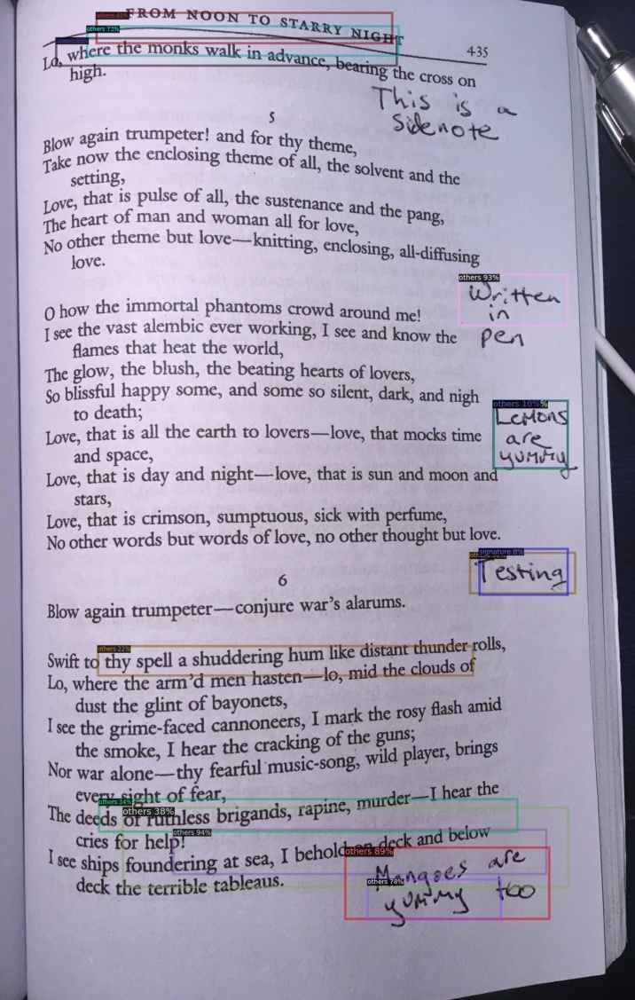
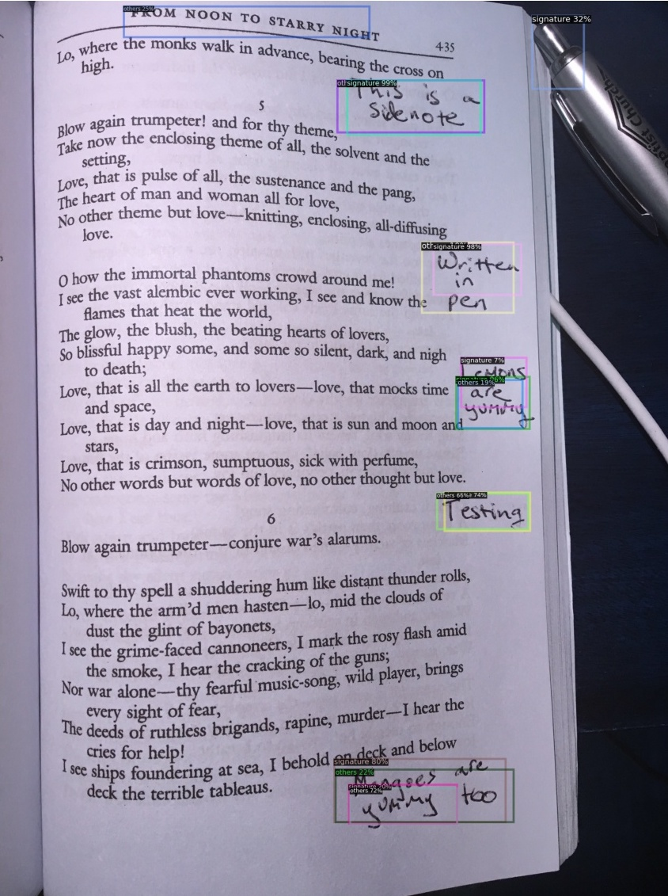

## Relevant works for Underline Feature
- [Detection and removal of hand-drawn underlines in a document image using approximate digital straightness](https://dl.acm.org/doi/abs/10.1145/2432553.2432576) (2012)
  - [Review](http://www.iraj.in/journal/journal_file/journal_pdf/6-162-1440572906136-140.pdf) (2015)

## Relevant works for Sidenote Feature

### Algorithms & Papers
- [Handwritten Text Segmentation via End-to-End Learning of Convolutional Neural Networks](https://arxiv.org/pdf/1906.05229.pdf) (2019)
- Watershed segmentation, [paper](http://ictactjournals.in/paper/IJIVP_V4_I3_Paper_7_767_772.pdf) (2014) referenced from [here](https://cs.stackexchange.com/a/88497)

### Code
- [Handwritten text detection in document images](https://github.com/crazycloud/Handwritten-text-Detection-Detectron2) repo
  - Uses Facebook's [Detectron 2](https://github.com/facebookresearch/detectron2)

### Handwritten Text Detection Repo
Results from testing out [this repo](https://github.com/crazycloud/Handwritten-text-Detection-Detectron2). Approach follows mainly from this [Microsoft blog post](https://devblogs.microsoft.com/cse/2018/05/07/handwriting-detection-and-recognition-in-scanned-documents-using-azure-ml-package-computer-vision-azure-cognitive-services-ocr/) and relies on this [small sample of Microsoft's dataset](https://github.com/CatalystCode/Handwriting). Uses [Detectron2](https://github.com/facebookresearch/detectron2) for the modeling. As you can see from the image, it's an imperfect approach. However, it does provide a starting place.

The performance improves after training on Microsoft's full 182-image dataset (instead of the small sample of 99 images). Their full dataset can be found in the Azure storage blob at `https://handwriting.blob.core.windows.net/leasedata`. Here is a sample result after training:

